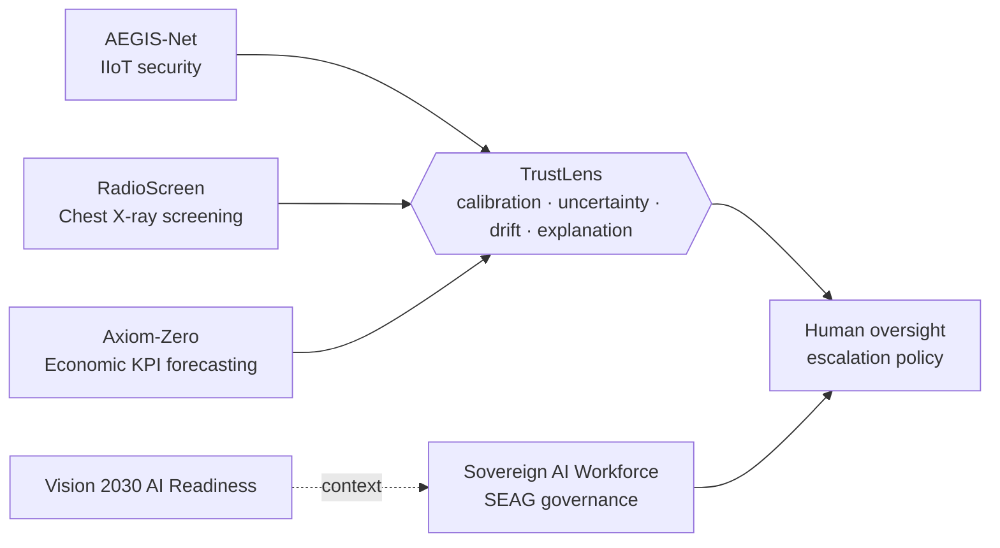

<!-- Put this file as README.md in a NEW public repo named exactly: fatehabderrahim189-prog/fatehabderrahim189-prog -->

# Fateh Abderrahim Boukhalfa
### AI Researcher & Builder · Algeria 🇩🇿
*Trustworthy, human-governed AI that strengthens human decision-making.*
**Research • Build • Evaluate • Explain • Improve**

## 🧭 How my projects fit together

## 🚀 Projects

| Project | What it is |
|---|---|
| **[TrustLens](https://github.com/fatehabderrahim189-prog/TrustLens)** | Model-agnostic trust & evaluation layer: calibration, conformal uncertainty, human-escalation thresholds, drift, model cards |
| **[Sovereign AI Workforce](https://github.com/fatehabderrahim189-prog/sovereign-ai-workforce)** | Schema-enforced approval gate (SEAG) for human-in-the-loop AI governance, with a documented experiment |
| **[AEGIS-Net](https://github.com/fatehabderrahim189-prog/AEGIS-Net)** | AI-assisted cybersecurity monitoring prototype for industrial IoT |
| **[RadioScreen](https://github.com/fatehabderrahim189-prog/RadioScreen)** | AI-assisted chest X-ray screening research prototype |
| **[Axiom-Zero](https://github.com/fatehabderrahim189-prog/Axiom-Zero)** | Linear vs non-linear KPI forecasting with explicit hold-out evaluation |
| **Vision 2030 AI Readiness** | Open-source, weighted 5-pillar framework to assess institutional AI readiness |

## 🛠 Focus
`Python` · `scikit-learn` · `PyTorch` · `Trustworthy AI` · `Conformal prediction` · `Model evaluation` · `Federated learning` · `Medical imaging`

## 📫 Contact
[Portfolio](https://spiffy-malabi-733f6e.netlify.app/) · fatehabderrahim189@gmail.com · [Instagram](https://www.instagram.com/fateh.ai.stem) · [TikTok](https://www.tiktok.com/@ai_pathway7)

> Student research prototypes: results are exploratory, not clinical or security-certified.
